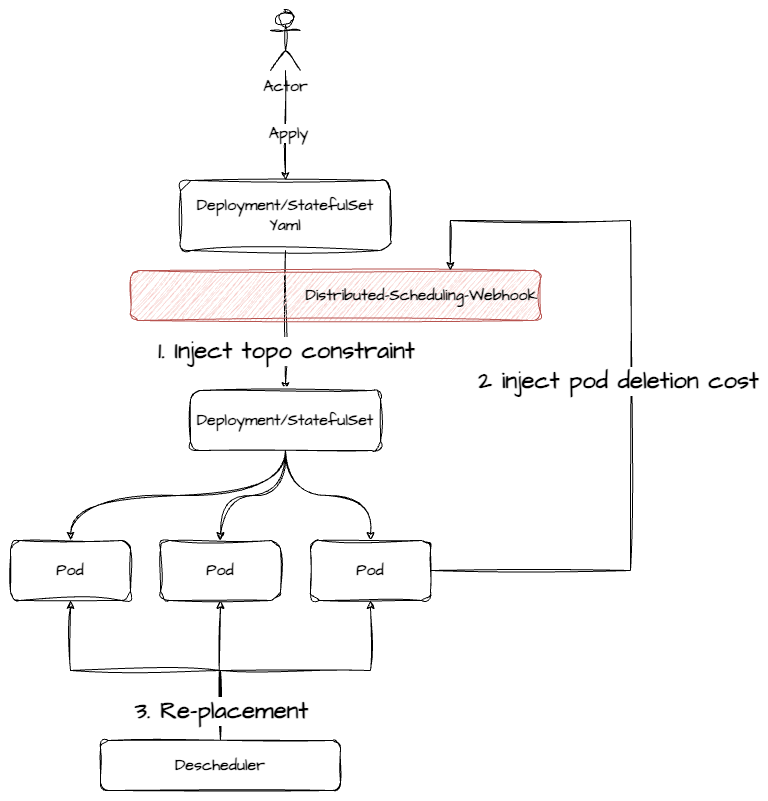
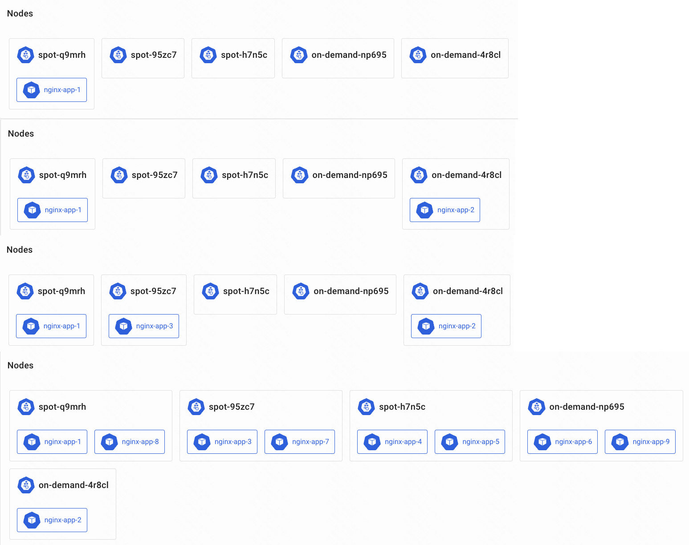

# Summary

## Supported Workload
- Deployment
- StatefulSet

## Rules
- Stability: Ensure that at least one available pod is deployed on an on-demand node throughout the entire lifecycle of the workload.
- Savings: Deploy pods to spot nodes as much as possible.

## Related Vanilla Features
- Topology Spread Constraints
- Pod Deletion Cost
- Descheduler


## Architecture
> in order to keep everything simple, introduce a mutating webhook to inject rules into deployment and pods.
>



### 1. inject topology spread constraints

take deployment as example, before injecting:
```yaml
spec:
  replicas: 9
  selector:
    matchLabels:
      app: nginx
  template:
    metadata:
      labels:
        app: nginx
    spec:
      containers:
      - name: nginx
```
after injecting:
```yaml
spec:
  replicas: 9
  selector:
    matchLabels:
      app: nginx
  template:
    metadata:
      labels:
        app: nginx
    spec:
      affinity:
        nodeAffinity:
          preferredDuringSchedulingIgnoredDuringExecution:
            - weight: 1
              preference:
                matchExpressions:
                  - key: node.kubernetes.io/capacity
                    operator: In
                    values:
                    - spot
      topologySpreadConstraints:
      - maxSkew: 1
        topologyKey: node.kubernetes.io/capacity
        whenUnsatisfiable: ScheduleAnyway
        labelSelector:
          matchLabels:
            app: nginx
        matchLabelKeys:
          - pod-template-hash
      containers:
      - name: nginx
```
So, the basic scheduling order is just like:



### 2. inject pod deletion cost
the rule is:
- a pod scheduled to spot node, add annotation: `controller.kubernetes.io/pod-deletion-cost: "10"`
- a pod scheduled to on-demand node, add annotation: `controller.kubernetes.io/pod-deletion-cost: "100"`

so, the pod on spot node will be deleted first during deployment scale down or upgrade.


### 3. after upgrade/scale down, the balance will be broken, so we need to use descheduler to fix it.
import policy like:
```yaml
apiVersion: "descheduler/v1alpha2"
kind: "DeschedulerPolicy"
profiles:
  - name: ProfileName
    pluginConfig:
      - name: "RemovePodsViolatingTopologySpreadConstraint"
        args:
          constraints:
            - DoNotSchedule
            - ScheduleAnyway
    plugins:
      balance:
        enabled:
          - "RemovePodsViolatingTopologySpreadConstraint"
```

