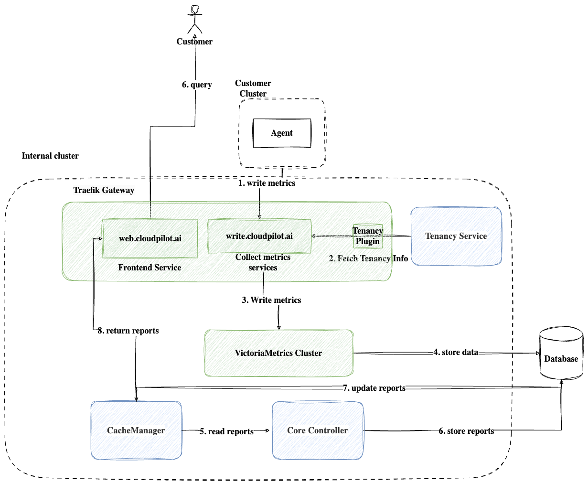

# Design
basic architecture will be like this:

workflow explanation:
1. Agent write metrics to write.cloudpilot.ai which is a traefik backend
2. Traefik invokes a plugin to register tenancy information, and inject tenant id to the request header
3. Traefik transfers the request to write api of a Victoria Metrics Cluster
4. Victoria Metrics Cluster will save data to the Database
5. Core-Controller will fetch all cluster infos and its reports from the CacheManager
6. Core-Controller generate latest reports if necessary(current report is out of date or not exists) and save them to the Database
7. CacheManager will always fetch the latest reports from the Database
8. CacheManager provides a api to fetch reports, and exported by frontend web.cloudpilot.ai

# Availability Statement
- Traefik and Victoria Metrics Cluster has its own HA solution.
- Set HPA and az-aware topology spread for other Deployments.
- Data Panel and Calculation Panel are divided into CacheManager and Core-Controller. Thus, they will not be affected by the failure of other components.

# Security Statement
- All request will separate by tenant id. This mechanism provides the ability to isolate request if necessary.
- Victoria Metrics Cluster support Multi-tenancy. So the data will be isolated.