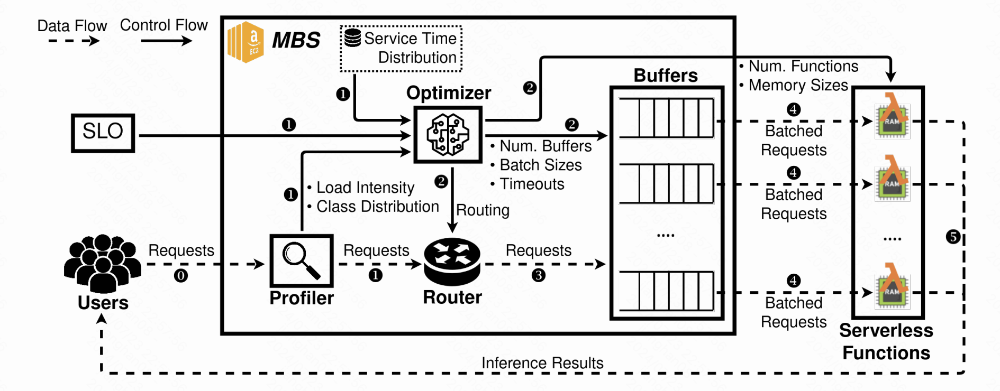
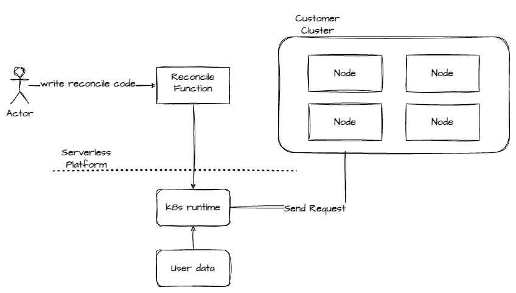

# GPU optimization
> There is a continuous stream of new research papers focusing on optimizations for training and inference. 
> We have to keep abreast of these developments and identifying innovations that can be integrated into the AI-Infra.

## Training
Cross-cloud Federated Learning
> https://github.com/FedML-AI/FedML

Self-Healing Cluster
> https://arxiv.org/pdf/2401.00134

## Inference
> https://par.nsf.gov/servlets/purl/10206149
> https://www.vldb.org/pvldb/vol15/p2071-ali.pdf

Building a architecture to distribute inference task on serverless platform with same SLOs in on-demand cluster:

# Others

## Reconcile with serverless function
> why:
> 1. no need to maintain Kubernetes clusters, thus reducing the costs associated with operations and deployment, while still ensuring performance
> 2. save costs in control plane
>
>

## Observability
1. By exploring the semantic relationships within different data through the design of OTEL's specifications, new paradigms for specifications can be formulated.
2. Focusing on the observability of training/inference performance, define performance issues in existing training/inference frameworks to provide solutions.
